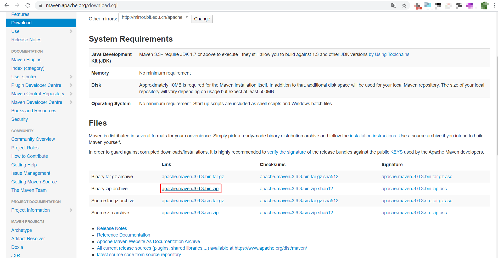
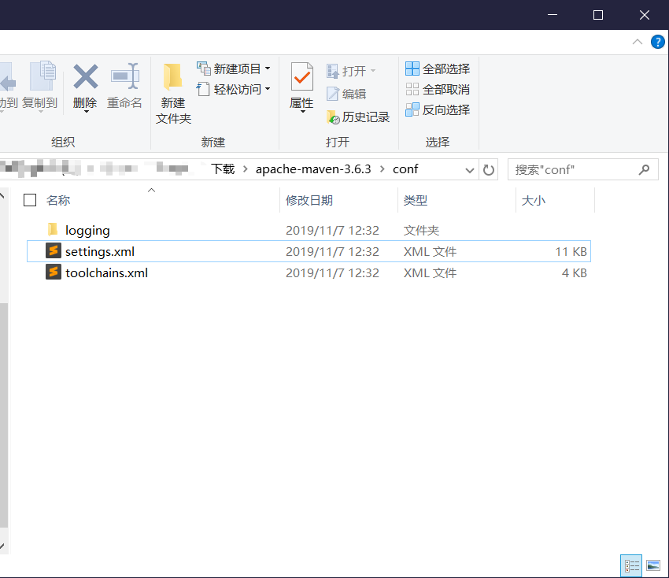
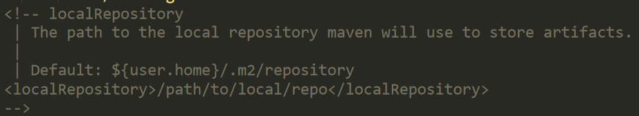
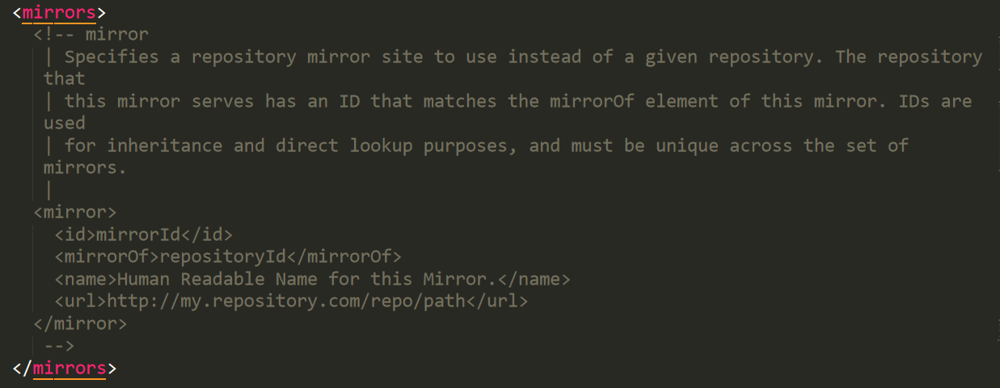
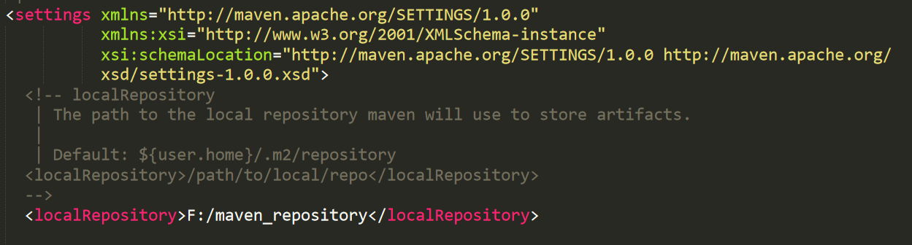
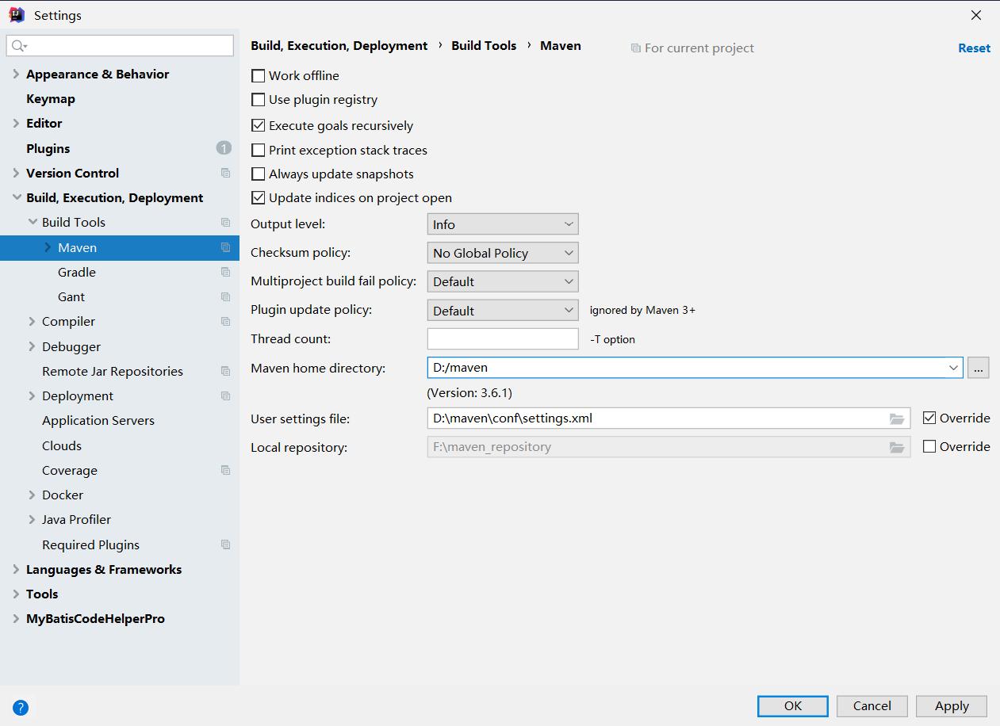
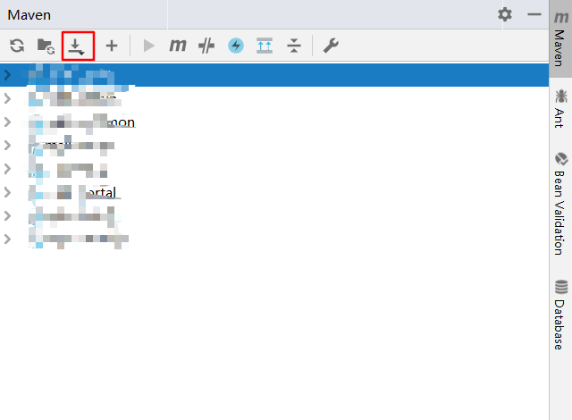

# Online-Exam-Platform-RD
「在线考试系统 - 后端」

## 可能会遇到的问题

环境：请保证你的jdk版本为8，Mysql的版本为5.x，Maven版本为最新即可。

### Maven新手指南

#### Maven下载及配置

Maven是Java开发中常用的一种第三方库（或包）的管理工具，也就是常说的依赖管理（但这与Spring中的依赖管理又有所区别，这里特指**已经被发布的库或包**）。

需要知道的是，Maven仅仅是一个工具，并非技术，故此处放上步骤。

1. 下载

2. 下载后解压缩，找到maven/conf/settings.xml

3. （建议将此文件先备份，以防止配置错误），打开此文件，需要配置两处。

第一处是本地仓库标签：

第二处是源镜像：

参考下图进行配置，本地标签中的地址需要根据实际情况设置（本地仓库中会放很多的第三方包，需要的空间较大，请自行设置）

源镜像一般个人用户设置为阿里的镜像，但部分企业也有自己的私有镜像，也需要根据实际情况设置。

#### idea中的maven设置

idea中自带有maven，但并未修改配置文件。

打开idea后，打开setting（快捷键：Ctrl+Alt+S），按下图设置即可。

打开项目后如果出现无资源的情况则按下图按钮即可：

